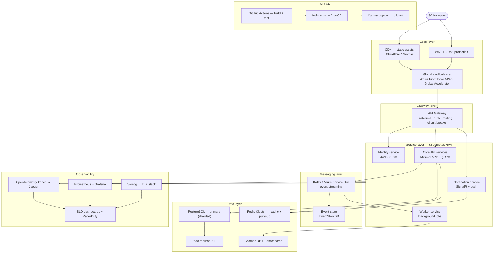

# Mastering .NET 2026 — Project Roadmap

> **Target**: Production system for **50 M+ users** · 99.99% uptime · multi-region  
> **Stack**: .NET 9 / ASP.NET Core · Kubernetes · PostgreSQL · Redis · Kafka

---

## Project structure

```
mastering-dotnet-2026/
├── 01 language core.md
├── 02 async  concurrency.md
├── 03 aspnetcore.md
├── 04 data persistence.md
├── 05 auth security.md
├── 06 architecture.md
├── 07 testing.md
├── 08 performance.md
├── 09 errors logging.md
├── 10 devops.md
└── Readme.md
```

---

## Learning phases

### Phase 1 · Foundation
| Module | Key topics |
|--------|-----------|
| `01 language core.md` | Records, pattern matching, `Span<T>`, nullability, source generators |
| `02 async concurrency.md` | `Task`, `ValueTask`, `IAsyncEnumerable`, channels, `Parallel.ForEachAsync` |

### Phase 2 · Backend core
| Module | Key topics |
|--------|-----------|
| `03 aspnetcore.md` | Minimal APIs, middleware pipeline, SignalR, gRPC, output caching |
| `04 data persistence.md` | EF Core 9, Dapper, Redis `IDistributedCache`, Cosmos DB, connection pooling |

### Phase 3 · Cross-cutting concerns
| Module | Key topics |
|--------|-----------|
| `05 auth security.md` | JWT, OAuth2, OIDC, ASP.NET Core Data Protection, RBAC/ABAC |
| `06 architecture.md` | Clean architecture, DDD, CQRS, vertical slices, MediatR, event sourcing |

### Phase 4 · Quality & reliability
| Module | Key topics |
|--------|-----------|
| `07 testing.md` | xUnit, Moq/NSubstitute, Testcontainers, WebApplicationFactory, mutation tests |
| `08 performance.md` | BenchmarkDotNet, `ArrayPool<T>`, `RecyclableMemoryStream`, load testing with k6 |
| `09 errors logging.md` | Serilog structured logs, OpenTelemetry traces, `ProblemDetails`, health checks |

### Phase 5 · Ship it
| Module | Key topics |
|--------|-----------|
| `10 devops.md` | Docker multi-stage builds, Kubernetes + HPA, Helm charts, GitHub Actions, ArgoCD, canary deploys |

---

## Production system — 50 M+ users

### Architecture overview (Mermaid)



---

### Layer breakdown

#### Edge layer
- **CDN** (Cloudflare / Akamai) — serve static assets, TLS termination, geo-routing
- **WAF** — OWASP Top 10 rules, bot mitigation, IP reputation
- **Global load balancer** — Azure Front Door or AWS Global Accelerator for anycast routing across regions

#### Gateway layer
- **API Gateway** — rate limiting (token bucket per user/IP), JWT validation, request routing, circuit breaker (Polly), request/response logging

#### Service layer — Kubernetes with HPA
| Service | Responsibility | Scaling trigger |
|---------|---------------|-----------------|
| Identity service | JWT issuance, OIDC, refresh tokens | CPU > 60% |
| Core API services | Business logic, Minimal APIs + gRPC | RPS / queue depth |
| Notification service | SignalR WebSocket hub, push, email | Active connections |
| Worker service | Background jobs, scheduled tasks | Queue depth (KEDA) |

> HPA can scale to **1 000+ pods** across nodes. Use KEDA for event-driven autoscaling tied to Kafka consumer lag.

#### Messaging layer
- **Kafka** — durable, ordered event streaming; use for order events, audit trails, fan-out
- **Azure Service Bus** — when at-least-once with sessions is preferred over Kafka
- **EventStoreDB** — append-only event store for CQRS event sourcing (module 06)

#### Data layer
| Store | Use case | Scaling strategy |
|-------|---------|-----------------|
| PostgreSQL (primary) | Transactional writes | Horizontal sharding by `user_id` hash |
| Read replicas × 10 | All `SELECT` queries via EF Core read routing | Async streaming replication |
| Redis Cluster | L2 cache, pub/sub, rate-limit counters | 6-node cluster, 3 primaries + 3 replicas |
| Cosmos DB | Global distributed NoSQL, low-latency reads | Multi-region write with conflict resolution |
| Elasticsearch | Full-text search, log aggregation | Dedicated cluster, rolling indices |

**Critical patterns at 50 M+ scale:**
- Route all reads to replicas (`UseQueryTrackingBehavior(NoTracking)` + read replica connection string in CQRS query handlers)
- Cache-aside with Redis; use `SET NX` + random TTL jitter (±10%) to prevent stampede
- Shard key strategy: `user_id % N` — avoids hotspots on sequential IDs

#### Observability
- **OpenTelemetry SDK** — instrument all services; export traces to Jaeger / Azure Monitor
- **Prometheus + Grafana** — RED metrics (Rate, Errors, Duration) per service; alert on p99 latency > 200 ms
- **Serilog** — structured JSON logs with `CorrelationId`; ship to Elasticsearch via Logstash
- **SLOs** — 99.99% availability target; burn rate alerts via PagerDuty

#### CI / CD pipeline
```
push → GitHub Actions
         ├── dotnet test (unit + integration via Testcontainers)
         ├── docker build --target release (multi-stage)
         ├── trivy image scan
         └── helm upgrade --install
                  └── ArgoCD sync → canary (5% traffic)
                           └── automated rollback on error rate spike
```

---

### Module → production system mapping

| Module | Production component it builds |
|--------|-------------------------------|
| 01 Language core | Hot-path performance in all services (`Span<T>`, pooling) |
| 02 Async & concurrency | Non-blocking I/O in API services, channel-based worker pipelines |
| 03 ASP.NET Core | All HTTP/gRPC/SignalR service surfaces |
| 04 Data persistence | PostgreSQL sharding, Redis cache-aside, Cosmos DB integration |
| 05 Auth & security | Identity service — JWT issuance, OIDC, WAF policy alignment |
| 06 Architecture | Microservice boundaries, CQRS read/write split, event sourcing |
| 07 Testing | Testcontainers integration suites for all data layer components |
| 08 Performance | BenchmarkDotNet baselines for hot paths; k6 load test scripts |
| 09 Errors & logging | Full OTel instrumentation, Serilog pipelines, health endpoints |
| 10 DevOps | Docker images, Helm charts, GitHub Actions, ArgoCD canary |

---

### Key scaling decisions

1. **Database fan-out** — CQRS routes all reads to replicas; primary only receives writes. Use EF Core's `DbContext` factory with two connection strings.
2. **Cache stampede prevention** — Redis `SET NX` with TTL jitter. Never cache with a fixed TTL when many keys expire simultaneously.
3. **Cold path vs hot path** — synchronous response for user-facing APIs; everything else (emails, analytics, audit) goes onto Kafka and is processed asynchronously by Worker services.
4. **Graceful degradation** — Polly circuit breakers on all outbound calls; return stale cache on downstream failure.
5. **Zero-downtime deploys** — rolling updates with `minReadySeconds`, readiness probes, and ArgoCD canary analysis on error rate.

---

*Generated from `mastering-dotnet-2026/` · April 2026*